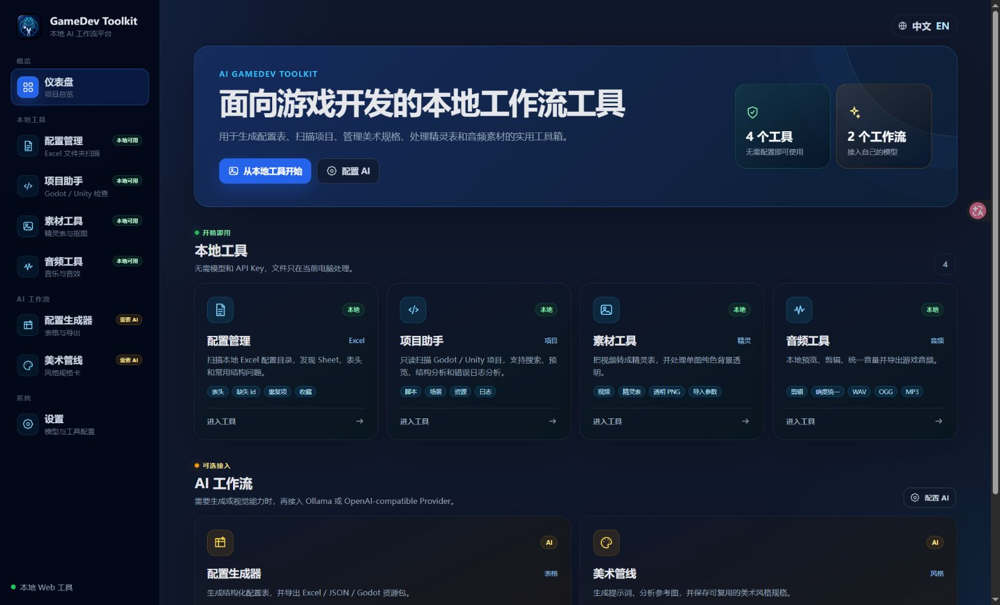
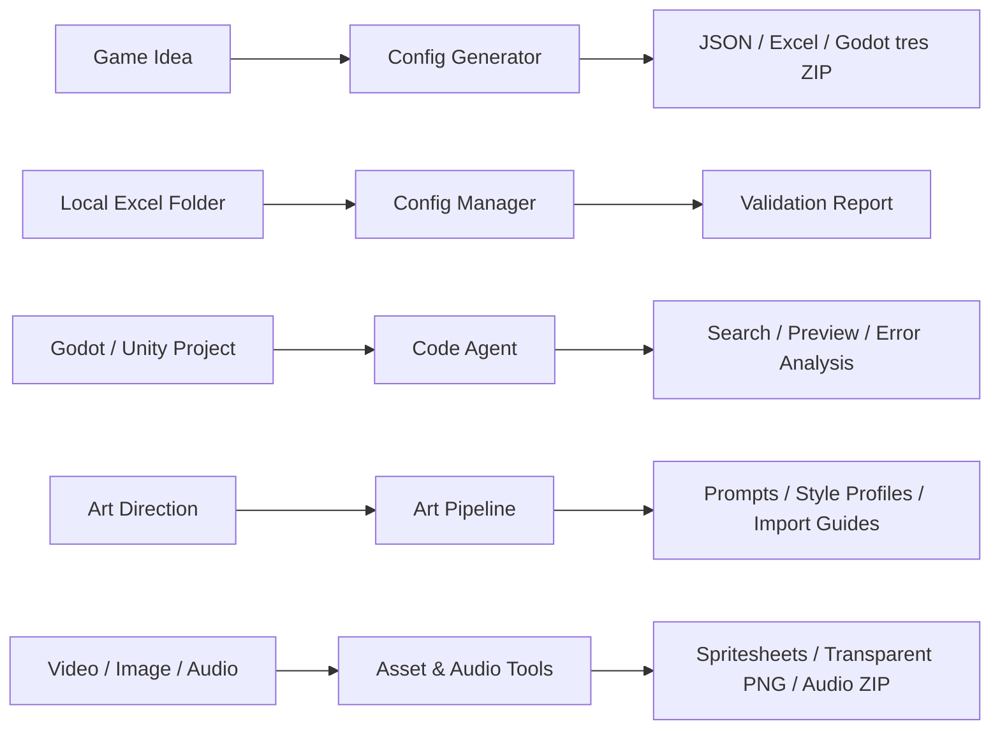
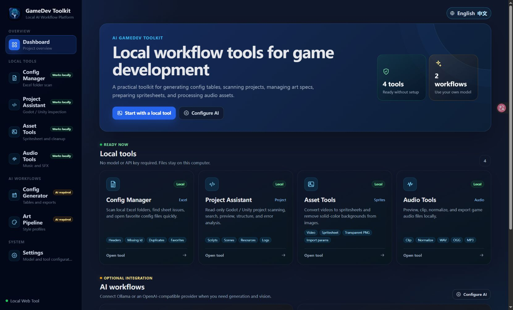

# AI GameDev Toolkit

<p align="center">
  
</p>

<p align="center">
  <strong>Local-first AI workflow toolkit for Godot and Unity game developers.</strong>
</p>

<p align="center">
  <a href="#zh">中文</a> ·
  <a href="#english">English</a> ·
  <a href="https://github.com/sylardie/-AI-GameDev-Toolkit/releases/tag/v0.1.0">Download v0.1.0</a>
</p>

<p align="center">
  <a href="LICENSE"></a>
  <a href="https://github.com/sylardie/-AI-GameDev-Toolkit/releases"></a>
  <a href="https://github.com/sylardie/-AI-GameDev-Toolkit/actions/workflows/ci.yml"></a>
  
  
</p>

---

<a id="zh"></a>

## 中文

AI GameDev Toolkit 是一个面向游戏开发者的本地优先 AI 工作流平台。它关注 Godot / Unity 项目中的实用生产任务：配置表、项目诊断、美术规范、资产处理、音频裁剪和发布打包，而不是做一个泛用聊天机器人。

> 当前版本：**v0.1.0 public preview**。项目已经可用，但 AI 服务商行为和生成内容仍建议由开发者人工复核。

### 功能亮点

| 工作流 | 能力 |
| --- | --- |
| Config Generator | 根据游戏想法生成 Unity / Godot 友好的结构化配置表，并导出 JSON / Excel / Godot `.tres` 资源包。 |
| Config Manager | 只读扫描本地 Excel 配置目录，展示工作簿、工作表、表头和基础诊断。 |
| Code Agent | 只读扫描 Godot / Unity 项目，支持文件分类、文本预览、搜索、脚本结构提取和错误日志分析。 |
| Art Pipeline | 生成美术风格规范、提示词、命名规则、导入指南，并支持可复用的 Art Style Profile。 |
| Asset Tools | 视频转 spritesheet、帧导出、简单纯色背景移除和引擎导入参数展示。 |
| Audio Tools | 本地音频预览、裁剪、可选响度标准化，以及 WAV / OGG / MP3 导出。 |

### 界面预览



### 工作流概览



### 快速启动

Windows 下在项目根目录运行：

```bat
scripts\start-dev.cmd
```

启动后访问：

```text
Backend:  http://127.0.0.1:8010
Frontend: http://127.0.0.1:5173
```

停止开发服务：

```bat
scripts\stop-dev.cmd
```

### 手动启动

后端：

```bat
cd backend
python -m venv .venv
.venv\Scripts\python.exe -m pip install -r requirements.txt
.venv\Scripts\python.exe -m uvicorn app.main:app --port 8010
```

前端：

```bat
cd frontend
npm.cmd install
npm.cmd run dev
```

### 桌面版

启动 Electron 桌面壳：

```bat
cd frontend
npm.cmd run electron:dev
```

构建 Windows 安装包和便携版：

```bat
cd frontend
npm.cmd run dist:win
```

构建产物输出到 `frontend/artifacts/`。完整发布流程见 [docs/RELEASING.md](docs/RELEASING.md)。

### 下载

Windows 预览版可在 GitHub Release 下载：

- [AI GameDev Toolkit v0.1.0](https://github.com/sylardie/-AI-GameDev-Toolkit/releases/tag/v0.1.0)
- 安装版：`AI.GameDev.Toolkit.Setup.0.1.0.exe`
- 便携版：`AI.GameDev.Toolkit.0.1.0.exe`

### 页面入口

```text
Dashboard:        http://127.0.0.1:5173/
Config Generator: http://127.0.0.1:5173/design
Config Manager:   http://127.0.0.1:5173/configs
Code Agent:       http://127.0.0.1:5173/code
Art Pipeline:     http://127.0.0.1:5173/art
Asset Tools:      http://127.0.0.1:5173/assets
Audio Tools:      http://127.0.0.1:5173/audio
Settings:         http://127.0.0.1:5173/settings
Backend docs:     http://127.0.0.1:8010/docs
```

### 集成与隐私

Settings 支持配置 OpenAI-compatible LLM、本地或远程 ComfyUI，以及可选的在线图片生成服务。配置生成需要可用的 LLM；图片生成和 ComfyUI 都是可选能力。

项目默认本地运行，不会自动写入外部 Godot / Unity 项目。API Key 通过后端本地设置保存，请在使用前阅读 [PRIVACY.md](PRIVACY.md)。

### 质量检查

```bat
cd frontend
npm.cmd run lint
npm.cmd run build
npm.cmd audit --audit-level=high

cd ..\backend
.venv\Scripts\python.exe -m pip check
.venv\Scripts\python.exe -m unittest discover -s tests -v
.venv\Scripts\python.exe -m compileall app
```

### 项目文档

- [隐私说明](PRIVACY.md)
- [安全策略](SECURITY.md)
- [贡献指南](CONTRIBUTING.md)
- [发布指南](docs/RELEASING.md)
- [MIT License](LICENSE)

---

<a id="english"></a>

## English

AI GameDev Toolkit is a local-first AI workflow platform for game developers. It focuses on practical Godot / Unity production tasks: configuration tables, project diagnostics, art specifications, asset processing, audio clipping, and release packaging rather than generic chatbot behavior.

> Current version: **v0.1.0 public preview**. The project is usable, but AI provider behavior and generated game-development output should still be reviewed by a human.

### Highlights

| Workflow | Capability |
| --- | --- |
| Config Generator | Generate structured Unity / Godot configuration tables and export JSON / Excel / Godot `.tres` resource packages. |
| Config Manager | Read-only scan local Excel configuration folders, then inspect workbooks, sheets, headers, and basic diagnostics. |
| Code Agent | Read-only scan Godot / Unity projects with file classification, text preview, search, script structure extraction, and error-log analysis. |
| Art Pipeline | Generate art style specifications, prompts, naming rules, import guides, and reusable Art Style Profiles. |
| Asset Tools | Convert videos into spritesheets, export selected frames, remove simple solid-color backgrounds, and show engine import parameters. |
| Audio Tools | Preview, clip, optionally normalize, and export local game audio as WAV / OGG / MP3 packages. |

### Interface Preview



### Workflow Overview


### Quick Start

On Windows, from the project root:

```bat
scripts\start-dev.cmd
```

This starts:

```text
Backend:  http://127.0.0.1:8010
Frontend: http://127.0.0.1:5173
```

To stop both dev servers:

```bat
scripts\stop-dev.cmd
```

### Manual Start

Backend:

```bat
cd backend
python -m venv .venv
.venv\Scripts\python.exe -m pip install -r requirements.txt
.venv\Scripts\python.exe -m uvicorn app.main:app --port 8010
```

Frontend:

```bat
cd frontend
npm.cmd install
npm.cmd run dev
```

### Desktop App

Start the Electron desktop shell:

```bat
cd frontend
npm.cmd run electron:dev
```

Build a Windows installer and portable executable:

```bat
cd frontend
npm.cmd run dist:win
```

Build artifacts are written to `frontend/artifacts/`. See [docs/RELEASING.md](docs/RELEASING.md) for the complete release process.

### Download

The Windows preview build is available from GitHub Releases:

- [AI GameDev Toolkit v0.1.0](https://github.com/sylardie/-AI-GameDev-Toolkit/releases/tag/v0.1.0)
- Installer: `AI.GameDev.Toolkit.Setup.0.1.0.exe`
- Portable: `AI.GameDev.Toolkit.0.1.0.exe`

### Main Pages

```text
Dashboard:        http://127.0.0.1:5173/
Config Generator: http://127.0.0.1:5173/design
Config Manager:   http://127.0.0.1:5173/configs
Code Agent:       http://127.0.0.1:5173/code
Art Pipeline:     http://127.0.0.1:5173/art
Asset Tools:      http://127.0.0.1:5173/assets
Audio Tools:      http://127.0.0.1:5173/audio
Settings:         http://127.0.0.1:5173/settings
Backend docs:     http://127.0.0.1:8010/docs
```

### Integrations and Privacy

Settings supports OpenAI-compatible LLM providers, local or remote ComfyUI, and optional online image-generation providers. Config generation requires a configured LLM; image generation and ComfyUI are optional.

The app is local-first and does not automatically write into external Godot / Unity projects. API keys are stored through local backend settings; read [PRIVACY.md](PRIVACY.md) before use.

### Quality Checks

```bat
cd frontend
npm.cmd run lint
npm.cmd run build
npm.cmd audit --audit-level=high

cd ..\backend
.venv\Scripts\python.exe -m pip check
.venv\Scripts\python.exe -m unittest discover -s tests -v
.venv\Scripts\python.exe -m compileall app
```

### Project Docs

- [Privacy](PRIVACY.md)
- [Security policy](SECURITY.md)
- [Contributing](CONTRIBUTING.md)
- [Release guide](docs/RELEASING.md)
- [MIT License](LICENSE)
